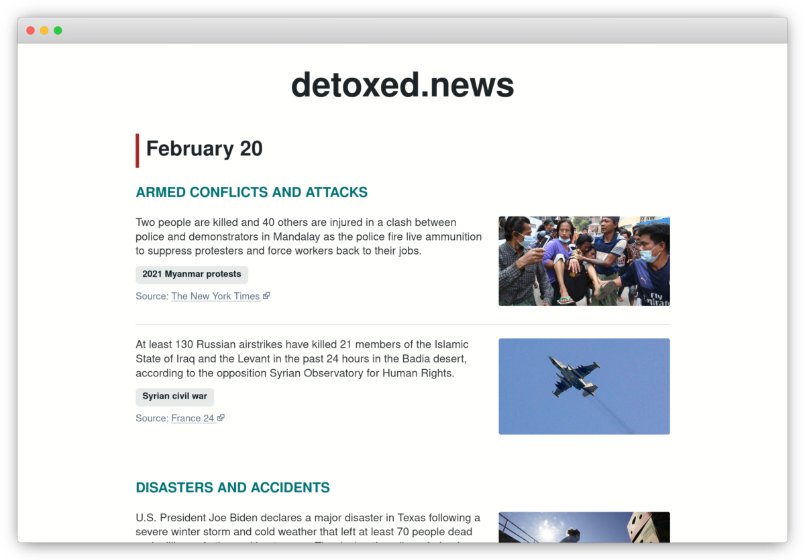

# [detoxed.news](https://detoxed.news)

The important news, without the toxicity.

<p align="center">
  
</p>

## The Why

I try stay informed about current events and important world affairs, but I find the modern always-on, always-dramatic news cycle both tiring and anxiety-inducing. The news industry has an incentive to keep readers coming back - the more time they spend on their sites, the more ad-revenue they can generate. This tends to lead to addiction-forming UX, clickbait, over-dramatization and all-round information overload for the user.

Most news I end up reading ends up being either uninformative speculation or unnecessary tweeted-to-the-minute drama, neither of which are truly worth my time and energy.

What I would like is to stay informed, but in the least draining way possible.

## The How

A fantastic source for a balanced, low-drama summary of news is the [Wikipedia Current Events Portal](https://en.wikipedia.org/wiki/Portal:Current_events). It is a user-curated list of current events per day, with items being tagged under a series of nested categories.

https://detoxed.news scrapes this page, collating the entries and associating them with their categories, which are treated as "tags", and the linked source article. Whilst the Current Events Portal is informative, it's extremely text-heavy and a bit of a chore to read. https://detoxed.news attempts to present this same information in a more user-friendly and digestable way.

## The Tech

The site is a static site built using [11ty](https://www.11ty.dev/). A build dynamically scrapes the current events portal and generates JSON which is then used to compile the `index.html` file.

The site is hosted on Cloudflare Pages and a new build is kicked off via a webhook that is called from a cronjob every four hours. This means the content of the site will keep in sync with the content of the current events portal without any kind of manual intervention ever being necessary.

## Development

Install dependencies:

```bash
npm i
```

Run in development mode, with live reloading:

```bash
npm run dev
```

Run tests:

```bash
npm t
```
